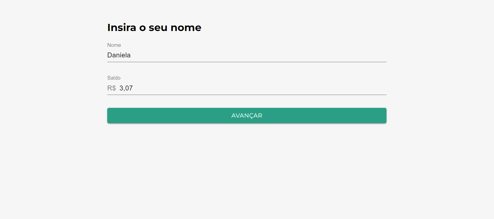
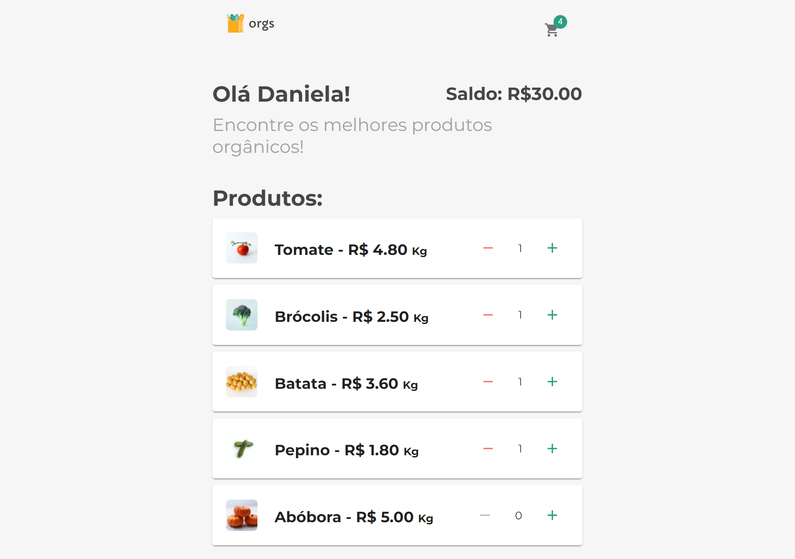
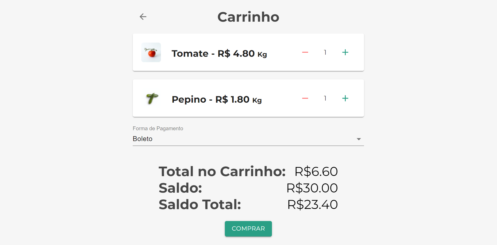
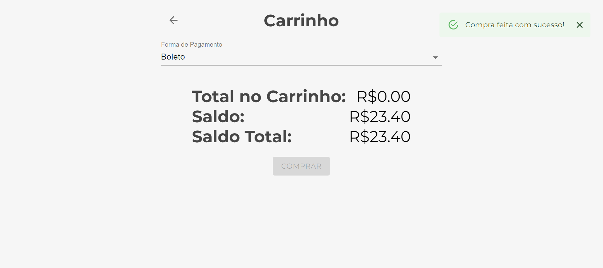

# Projeto Feira

- Projeto desenvolvido no Curso React: gerenciamento de estados globais com ContextAPI da plataforma Alura

## Tecnologia utilizadas

- JavaScript;
- React;
- ContextAPI

## Comando para executar a aplicação

### `yarn start`

## Caso queira testar a aplicação acess o link com o deploy na Vercel no canto superior direito

# Páginas da aplicação

## Login

## Produtos

## Carrinho

## Finalização da compra

